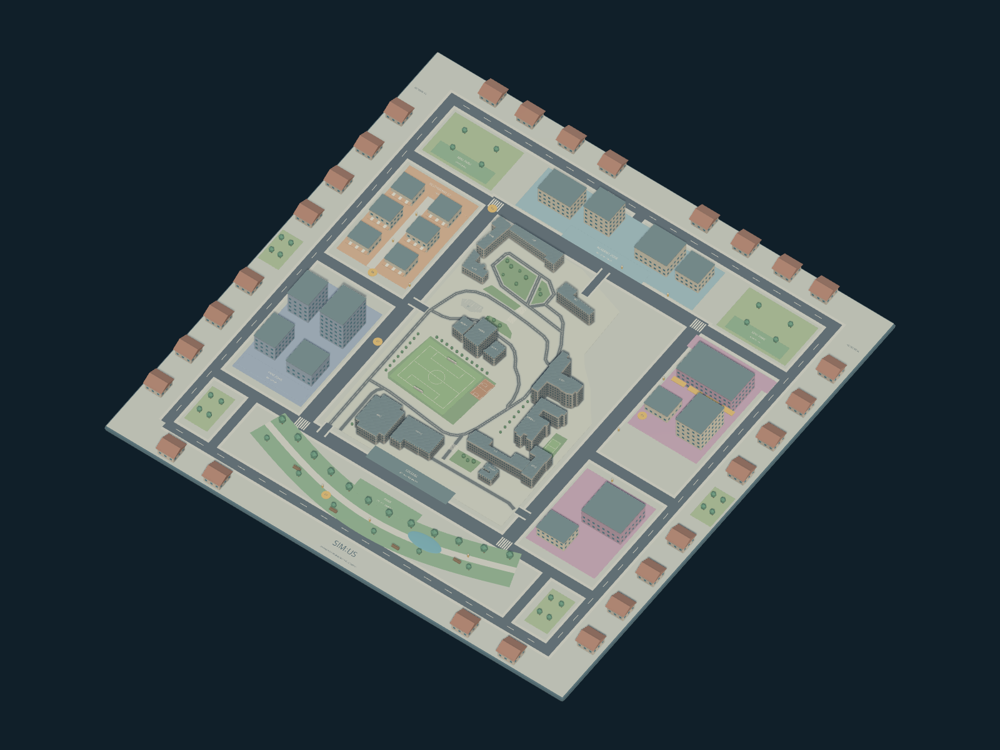
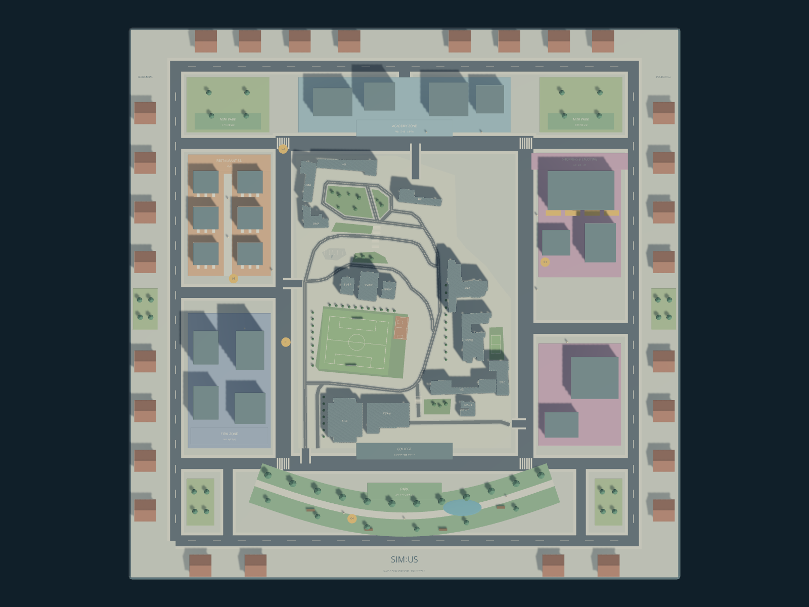

# Unity 동네 맵 시제품

GPT 작업 폴더에서 제작한 정적 맵 장면을 기존 Unity 프로젝트의 `Assets/`에 병합했습니다.
제작·검증에 사용한 Editor는 Unity 6000.3.24f1이며, 같은 버전의
`ProjectSettings/ProjectVersion.txt`를 추가했습니다. 기존 `Packages/manifest.json`은 유지했습니다.

## 열기와 조작

1. Unity 6000.3.24f1에서 저장소의 `unity/`를 엽니다.
2. `Assets/Scenes/Neighborhood.unity`를 열고 Play를 누릅니다.
3. 왼쪽 드래그로 회전하고, 오른쪽 또는 가운데 드래그로 이동하며, 스크롤로 확대·축소합니다.
4. `1` 또는 `R`로 조감도, `2`로 배치도를 표시합니다. 화면 상단 버튼으로도 전환할 수 있습니다.

장면에는 200×200m 동네 맵, 카메라, 조명, 재질이 있습니다. 서버 연결과 도시 스탯 변화는
아직 이 장면에 연결되지 않았습니다. 기존 API 연동 시각화는 별도 빈 장면에서 실행합니다.
장면 실행 시 자동으로 생성되던 도시 시각화는 이 장면에서만 건너뛰도록 설정했습니다.

## 출처와 검증 범위

- 모델: `Assets/Art/Neighborhood.fbx` 및 대응 `.meta`
- 장면: `Assets/Scenes/Neighborhood.unity` 및 대응 `.meta`
- 재질: FBX의 GUID 매핑이 실제로 참조하는 `Assets/Materials/`의 32개 파일과 `.meta`
- 표현: `Assets/Shaders/CitySurface.shader`, `Assets/Scripts/CityPreviewCamera.cs` 및 `.meta`
- 원본 Unity 6000.3.24f1 검증: 725개 메시 렌더러, 32개 재질 매핑, 200×18.25×200m 경계,
  카메라 전환 Play 검사. 자세한 당시 기록은 [검증 결과](verification.md)에 있습니다.

병합 후 장면·FBX·재질·셰이더·스크립트의 GUID 참조를 확인했습니다. 또한 이 저장소의
`unity/` 프로젝트를 Unity 6000.3.24f1에서 열어 `Neighborhood` 장면의 Play Mode가
정상 동작하는 것을 확인했습니다.

